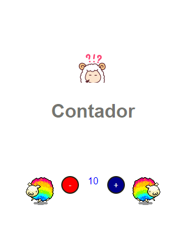

# Atividade DIO - Introdução ao JavaScript
## Contador
**Sobre** 
Está atividade tem o entuito de firmar alguns conceitos.
- O uso de **addEventListener** afim de manter o código html mais organizado, não tendo a necessidade de adicionar o evento na tag no arquivo html, usando o id como referência e espeficiando o evento e a função a ser executada com o uso do mesmo.  *Lembrando que, ao se fazer o uso de **addEventListener** não se usa o prefixo "on" na chamada do evento.*
- O uso de condicionais para alterar aspectos do layout com a manipulação do usuário.
